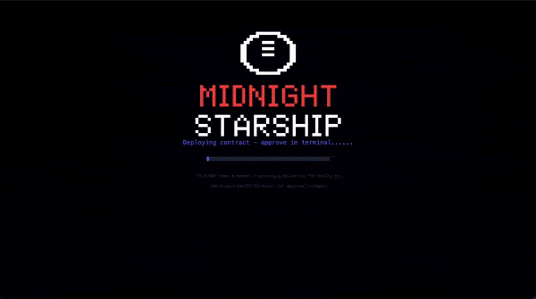

# Midnight Starship



A Galaga-style game with a privacy-first on-chain leaderboard. Built as a reference for connecting browser DApps to the [Midnight wallet CLI](https://github.com/nel349/midnight-wallet-cli) via `midnight serve`. Inspired by [jwilliams219/galaga](https://github.com/jwilliams219/galaga).

Scores are stored as commitment hashes — nobody can see your score unless you choose to reveal it. You can prove "my score is above X" with a zero-knowledge proof without disclosing the actual number.

## Prerequisites

- Node.js >= 20
- Docker (for local development)
- [midnight-wallet-cli](https://www.npmjs.com/package/midnight-wallet-cli) — `npm install -g midnight-wallet-cli`

## Getting Started — Local (undeployed)

```bash
# 1. Set up the wallet
mn wallet generate alice
mn config set network undeployed

# 2. Start the local network (node, indexer, proof server)
mn localnet up

# 3. Fund your wallet and register dust (needed for transaction fees)
mn airdrop 1000
mn dust register

# 4. Install dependencies and compile the contract
npm install
cd contract && npm run compact && cd ..

# 5. Start the wallet connector (in a separate terminal)
mn serve

# 6. Build and start the game
cd game-ui && npm run build:start:undeployed
```

Open `http://localhost:4173`. The game connects to the wallet at `ws://localhost:9932`.

## Getting Started — Preview

```bash
# 1. Set up the wallet
mn wallet generate alice
mn config set network preview

# 2. Get test tokens from the faucet
#    Go to https://faucet.preview.midnight.network/
#    Paste your address: mn wallet info alice (copy the preview address)

# 3. Register dust (needed for transaction fees)
mn dust register

# 4. Install dependencies and compile the contract
npm install
cd contract && npm run compact && cd ..

# 5. Start the wallet connector (in a separate terminal)
mn serve

# 6. Build and start the game
cd game-ui && npm run build:start
```

Open `http://localhost:4173`. The game connects to the wallet at `ws://localhost:9932`.

## Getting Started — Preprod

```bash
# 1. Set up the wallet
mn wallet generate alice
mn config set network preprod

# 2. Get test tokens from the faucet
#    Go to https://faucet.preprod.midnight.network/
#    Paste your address: mn wallet info alice (copy the preprod address)

# 3. Register dust (needed for transaction fees)
mn dust register

# 4. Install dependencies and compile the contract
npm install
cd contract && npm run compact && cd ..

# 5. Start the wallet connector (in a separate terminal)
mn serve

# 6. Build and start the game
cd game-ui && npm run build:start:preprod
```

Open `http://localhost:4173`. The game connects to the wallet at `ws://localhost:9932`.

## How It Works

```
┌─────────────┐   WebSocket    ┌──────────────────┐    Midnight
│  Browser     │◄──JSON-RPC───►│  midnight serve   │◄──Network──►
│  (game-ui)   │   :9932       │  (wallet CLI)     │
└──────┬───────┘               └──────────────────-┘
       │
       │  midnight-wallet-connector
       │
       ▼
  DApp Connector API
  - balanceUnsealedTransaction
  - submitTransaction
  - getShieldedAddresses
  - getConfiguration
```

The browser DApp never holds keys. All transaction signing, proving, and submission goes through `midnight serve`, which prompts the operator for approval in the terminal.

## Project Structure

```
contract/     Compact smart contract
  src/starship.compact    — ledger, circuits, witnesses
  src/witnesses.ts        — private state (secret key + score)
  src/test/               — unit tests (no network needed)
api/          TypeScript API layer
  src/common-types.ts     — LeaderboardEntry, LeaderboardState
  src/index.ts            — StarshipAPI (deploy/join/submit/prove/reveal)
game-ui/      Vite + Canvas 2D game
  src/providers/          — wallet connector + midnight providers
```

## Privacy Model

| On-chain | What's visible |
|----------|---------------|
| `scoreCommitments` | Hash of (playerHash, score) — not the score |
| `revealedScores` | Only if the player calls `reveal_score` |
| `aliases` | Player-chosen display name |
| `topScore` | Highest *revealed* score only |

Three circuits:

- **`submit_score`** — stores a commitment hash on-chain, keeps the real score in private state
- **`prove_elite`** — ZK proof that your hidden score >= a threshold, verified against the commitment
- **`reveal_score`** — voluntary: publishes your actual score for everyone to see

## Connecting to the Wallet

The game uses [`midnight-wallet-connector`](https://www.npmjs.com/package/midnight-wallet-connector) to talk to `midnight serve`:

```typescript
import { createWalletClient } from 'midnight-wallet-connector';

const wallet = await createWalletClient({
  url: 'ws://localhost:9932',
  networkId: 'Undeployed',
});

// Get endpoints from the wallet
const config = await wallet.getConfiguration();

// Build providers using those endpoints
const providers = {
  publicDataProvider: indexerPublicDataProvider(config.indexerUri, config.indexerWsUri),
  proofProvider: httpClientProofProvider(config.proverServerUri, zkConfigProvider),
  walletProvider: {
    getCoinPublicKey: () => walletState.shieldedCoinPublicKey,
    balanceTx: (tx) => wallet.balanceUnsealedTransaction(serialize(tx)),
  },
  midnightProvider: {
    submitTx: (tx) => wallet.submitTransaction(serialize(tx)),
  },
  // ...
};

// Deploy or join a contract
const api = await StarshipAPI.deploy(providers);
// or
const api = await StarshipAPI.join(providers, contractAddress);
```

See `game-ui/src/providers/` for the complete wiring.

## Testing

Unit tests run the contract circuits locally — no network, no Docker:

```
cd contract && npm test
```

```
 ✓ src/test/starship.test.ts (20 tests) 159ms
   ✓ Starship contract
     ✓ submit_score > stores a commitment, not a plaintext score
     ✓ prove_elite > fails when score < threshold
     ✓ reveal_score > publishes the actual score
     ✓ multi-player > revealing one player does not reveal the other
     ...
```

## Build

```
npm run build                  # builds all workspaces
cd game-ui && npm run build    # production build (preview network)
```

The build copies ZK keys and zkir artifacts into `dist/` so the browser can fetch them for proof generation.
